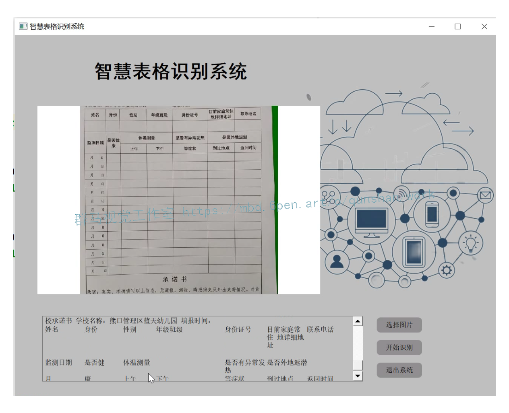
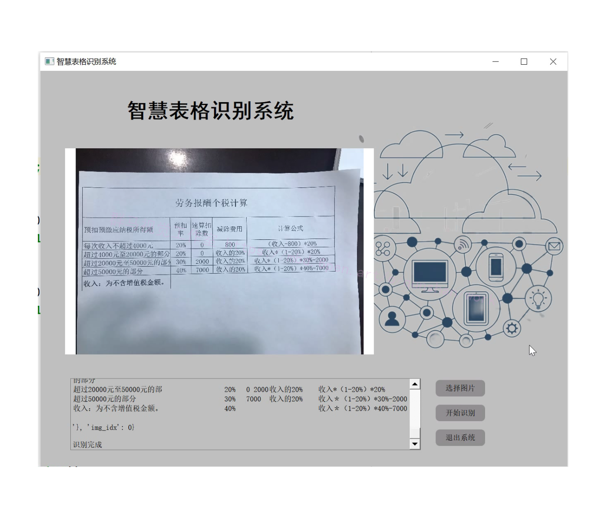
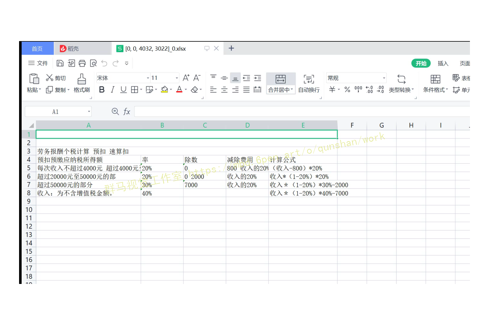
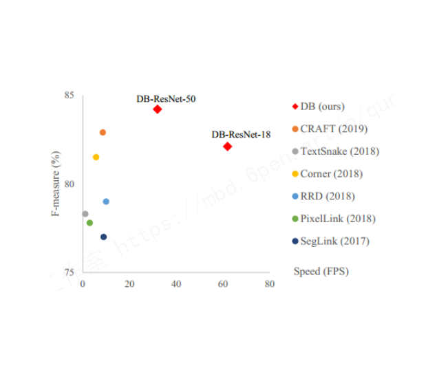
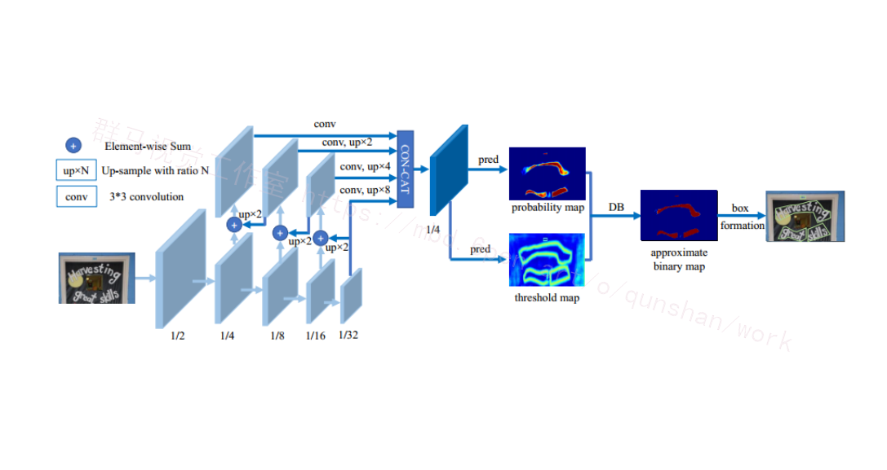
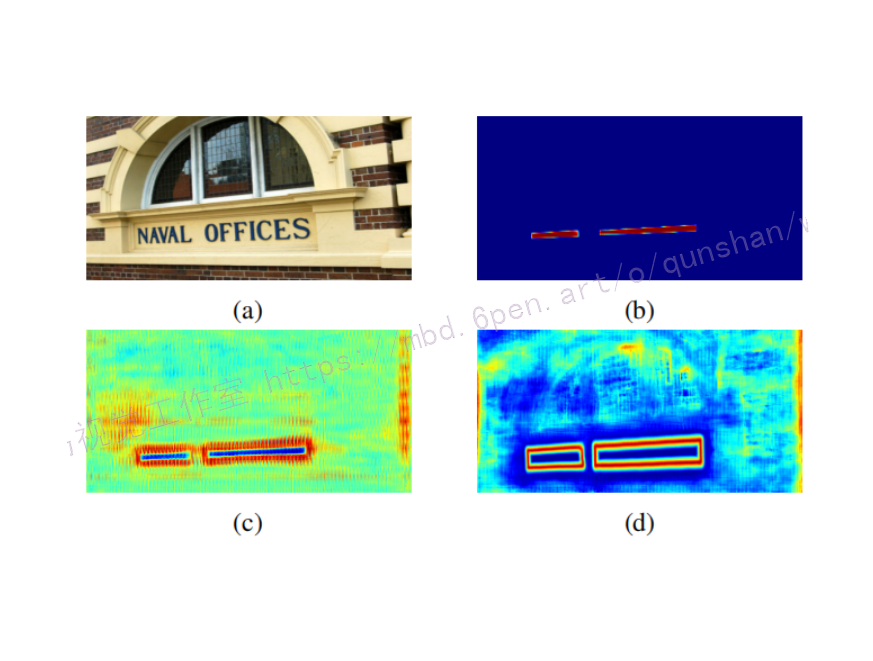
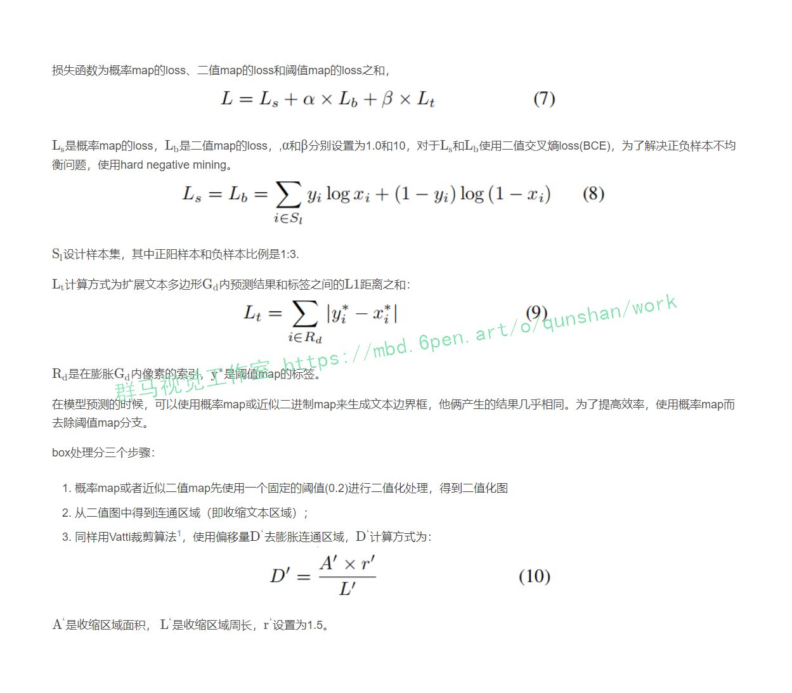
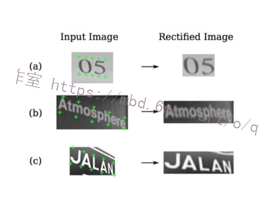
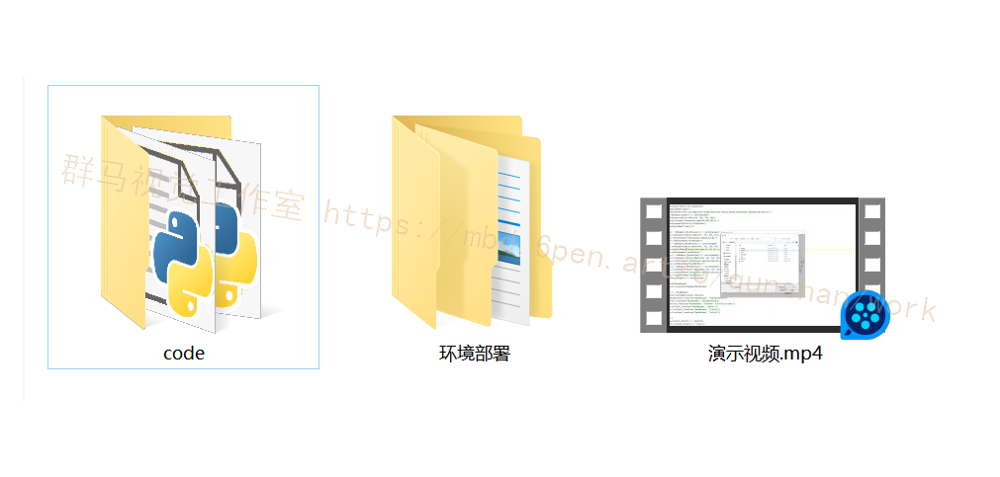

# 1.研究背景
随着经济的发展，票据在生活中的使用量越来越大，在票据信息审核和财务报销等流程中，财务人员需要人工将票据信息录入到计算机系统中，这是一项繁重的任务。随着版面分析以及文字识别技术的发展，票据自动识别及录入成为了可能。票据识别和自动录入包括票据版面分割、文字检测与识别等多个部分，由于票据识别的实际需求是输出结构化的信息，因此票据版面分割具有非常重要的作用。

# 2.图片演示





# 3.视频演示

[改进DB＆RARE智慧表格分割识别系统（源码＆教程） - 西瓜视频 (ixigua.com)](https://www.ixigua.com/7155390243099640333?utm_source=xiguastudio)


# 4.DB文本坐标检测
#### 概述

由于分割网络的结果可以准确描述诸如扭曲文本的场景，因而基于分割的自然场景文本检测方法变得流行起来。基于分割的方法其中关键的步骤是其后处理部分，这步中将分割的结果转换为文本框或是文本区域。[本文参考的文本检测方法](https://mbd.pub/o/bread/Y5qXmJtq)也是基于分割的，但是通过提出Differenttiable Binarization module（DB module）来简化分割后处理步骤（加了一个变的预测），并且可以设定自适应阈值来提升网络性能。文章的方法在现有5个数据上在检测精度与速度上均表现为state-of-art。在换用轻量级的backbone（ResNet-18）之后可以将检测帧率提升到62FPS，其与其它一些文本检测算法的性能与速率关系见图所示。


#### 网络结构

文章的网络结构见图所示，输入的图像经过不同stage的采样之后获得不同大小的特征图，之后这些由这些特征图构建特征金字塔，从而构建出统一尺度（相比原图像stride=8）的特征图FFF，之后这个特征图用于预测分割概率图PPP与阈值图TTT，之后将PTP,TPT结合得到估计的二值图


#### 算法改进
##### 自适应阈值
阈值map使用流程如图所示，使用阈值map和不适用阈值map的效果对比如图6所示，从图6©中可以看到，即使没用带监督的阈值map，阈值map也会突出显示文本边界区域，这说明边界型阈值map对最终结果是有利的。所以，本文[在阈值map上选择监督训练](https://afdian.net/item?plan_id=875bba6058c411ed9cec52540025c377)，已达到更好的表现。


##### 可变形卷积Deformable convolution
可变形卷积可以提供模型一个灵活的感受野，这对于不同纵横比的文本很有利，本文应用可变形卷积，使用3×3卷积核在ResNet-18或者ResNet-50的conv3，conv4，conv5层。

##### 损失函数


# 5.RARE表格定位分割
##### 概述
场景文字检测的难点有很多，仿射变换是其中一种，Jaderberg[2]等人提出的STN通过预测仿射变换矩阵的方式对输入图像进行矫正。但是真实场景的不规则文本要复杂的多，可能包括扭曲，弧形排列等情况（如图）,这种方式的变换是传统的STN解决不了的，因此作者提出了基于TPS的STN。TPS非常强大的一点在于其可以近似所有和生物有关的形变。


#####算法改进
合并算法，将这些segment（切片）、link（链接）合并成一个完整的文本行，得出完整文本行的检测框位置和旋转角度。该模型以VGG16作为网络的主要骨干，将其中的全连接层（fc6, fc7）替换成卷积层（conv6, conv7），后面再接上4个卷积层（conv8, conv9, conv10, conv11），其中，将conv4_3，conv7，conv8_2，conv9_2，conv10_2，conv11这6个层的feature map（特征图）拿出来做卷积得到segments（切片）和links（链接）。这6个层的feature map（特征图）尺寸是不同的，每一层的尺寸只有前一层的一半，从这6个不同尺寸的层上得到segment和link，就可以实现对不同尺寸文本行的检测了（大的feature map擅长检测小物体，小的feature map擅长检测大物体）。


##### 合并SegLink模型的网络结构


# 6.代码实现
```
class StructureSystem(object):
    def __init__(self, args):
        self.mode = args.mode
        if self.mode == 'structure':
            if not args.show_log:
                logger.setLevel(logging.INFO)
            if args.layout == False and args.ocr == True:
                args.ocr = False
                logger.warning(
                    "When args.layout is false, args.ocr is automatically set to false"
                )
            args.drop_score = 0
            # init layout and ocr model
            self.text_system = None
            if args.layout:
                import layoutparser as lp
                config_path = None
                model_path = None
                if os.path.isdir(args.layout_path_model):
                    model_path = args.layout_path_model
                else:
                    config_path = args.layout_path_model
                self.table_layout = lp.PaddleDetectionLayoutModel(
                    config_path=config_path,
                    model_path=model_path,
                    label_map=args.layout_label_map,
                    threshold=0.5,
                    enable_mkldnn=args.enable_mkldnn,
                    enforce_cpu=not args.use_gpu,
                    thread_num=args.cpu_threads)
                if args.ocr:
                    self.text_system = TextSystem(args)
            else:
                self.table_layout = None
            if args.table:
                if self.text_system is not None:
                    self.table_system = TableSystem(
                        args, self.text_system.text_detector,
                        self.text_system.text_recognizer)
                else:
                    self.table_system = TableSystem(args)
            else:
                self.table_system = None

        elif self.mode == 'vqa':
            raise NotImplementedError

    def __call__(self, img, return_ocr_result_in_table=False):
        if self.mode == 'structure':
            ori_im = img.copy()
            if self.table_layout is not None:
                layout_res = self.table_layout.detect(img[..., ::-1])
            else:
                h, w = ori_im.shape[:2]
                layout_res = [AttrDict(coordinates=[0, 0, w, h], type='Table')]
            res_list = []
            for region in layout_res:
                res = ''
                x1, y1, x2, y2 = region.coordinates
                x1, y1, x2, y2 = int(x1), int(y1), int(x2), int(y2)
                roi_img = ori_im[y1:y2, x1:x2, :]
                if region.type == 'Table':
                    if self.table_system is not None:
                        res = self.table_system(roi_img,
                                                return_ocr_result_in_table)
                else:
                    if self.text_system is not None:
                        filter_boxes, filter_rec_res = self.text_system(roi_img)
                        # remove style char
                        style_token = [
                            '<strike>', '<strike>', '<sup>', '</sub>', '<b>',
                            '</b>', '<sub>', '</sup>', '<overline>',
                            '</overline>', '<underline>', '</underline>', '<i>',
                            '</i>'
                        ]
                        res = []
                        for box, rec_res in zip(filter_boxes, filter_rec_res):
                            rec_str, rec_conf = rec_res
                            for token in style_token:
                                if token in rec_str:
                                    rec_str = rec_str.replace(token, '')
                            box += [x1, y1]
                            res.append({
                                'text': rec_str,
                                'confidence': float(rec_conf),
                                'text_region': box.tolist()
                            })
                res_list.append({
                    'type': region.type,
                    'bbox': [x1, y1, x2, y2],
                    'img': roi_img,
                    'res': res
                })
            return res_list
        elif self.mode == 'vqa':
            raise NotImplementedError
        return None


def save_structure_res(res, save_folder, img_name):
    excel_save_folder = os.path.join(save_folder, img_name)
    os.makedirs(excel_save_folder, exist_ok=True)
    res_cp = deepcopy(res)
    # save res
    with open(
            os.path.join(excel_save_folder, 'res.txt'), 'w',
            encoding='utf8') as f:
        for region in res_cp:
            roi_img = region.pop('img')
            f.write('{}\n'.format(json.dumps(region)))

            if region['type'] == 'Table' and len(region[
                    'res']) > 0 and 'html' in region['res']:
                excel_path = os.path.join(excel_save_folder,
                                          '{}.xlsx'.format(region['bbox']))
                to_excel(region['res']['html'], excel_path)
            elif region['type'] == 'Figure':
                img_path = os.path.join(excel_save_folder,
                                        '{}.jpg'.format(region['bbox']))
                cv2.imwrite(img_path, roi_img)


def main(args):
    image_file_list = get_image_file_list(args.image_dir)
    image_file_list = image_file_list
    image_file_list = image_file_list[args.process_id::args.total_process_num]

    structure_sys = StructureSystem(args)
    img_num = len(image_file_list)
    save_folder = os.path.join(args.output, structure_sys.mode)
    os.makedirs(save_folder, exist_ok=True)

    for i, image_file in enumerate(image_file_list):
        logger.info("[{}/{}] {}".format(i, img_num, image_file))
        img, flag = check_and_read_gif(image_file)
        img_name = os.path.basename(image_file).split('.')[0]

        if not flag:
            img = cv2.imread(image_file)
        if img is None:
            logger.error("error in loading image:{}".format(image_file))
            continue
        starttime = time.time()
        res = structure_sys(img)

        if structure_sys.mode == 'structure':
            save_structure_res(res, save_folder, img_name)
            draw_img = draw_structure_result(img, res, args.vis_font_path)
            img_save_path = os.path.join(save_folder, img_name, 'show.jpg')
        elif structure_sys.mode == 'vqa':
            raise NotImplementedError
            # draw_img = draw_ser_results(img, res, args.vis_font_path)
            # img_save_path = os.path.join(save_folder, img_name + '.jpg')
        cv2.imwrite(img_save_path, draw_img)
        logger.info('result save to {}'.format(img_save_path))
        elapse = time.time() - starttime
        logger.info("Predict time : {:.3f}s".format(elapse))
```

# 7.系统整合


# 8.[完整源码＆环境部署视频教程＆自定义UI界面](https://s.xiaocichang.com/s/0e4679)

# 9.参考文献
***
[1]廖玉钦.增值税发票自动识别算法研究[J].大连海事大学.2018.
[2]汤雷雷.基于深度学习的税务票据自动识别系统的研究及实现[J].中国科学院大学.2019.
[3]李航, 著. 统计学习方法 [M].清华大学出版社,2012.
[4]Yanli Wang,Yuchun Huang,Weihong Huang.Crack Junction Detection in Pavement Image Using Correlation Structure Analysis and Iterative Tensor Voting[J].IEEE Access.2019.7138094-138109.DOI:10.1109/ACCESS.2019.2942318.
[5]Chen, Zhuo,Liu, Chun,Wu, Hangbin.A higher-order tensor voting-based approach for road junction detection and delineation from airborne LiDAR data[J].ISPRS journal of photogrammetry and remote sensing.2019,150(Apr.).91-114.DOI:10.1016/j.isprsjprs.2019.02.003.
[6]Hanjin Zhang,Yang Yang,Hongbin Shen.Line Junction Detection Without Prior-Delineation of Curvilinear Structure in Biomedical Images[J].IEEE Access.2017.62016-2027.DOI:10.1109/ACCESS.2017.2781280.
[7]Myronenko, Andriy,Song, Xubo.Point Set Registration: Coherent Point Drift[J].IEEE Transactions on Pattern Analysis and Machine Intelligence.2010,32(12).2262-2275.
[8]Myronenko, Andriy,Song, Xubo.Point Set Registration: Coherent Point Drift[J].IEEE Transactions on Pattern Analysis & Machine Intelligence.2010,32(12).
[9]Awrangjeb M.,Lu G..An Improved Curvature Scale-Space Corner Detector and a Robust Corner Matching Approach for Transformed Image Identification[J].IEEE Transactions on Image Processing.2008,17(12).
[10]Sinzinger ED.A model-based approach to junction detection using radial energy[J].Pattern Recognition: The Journal of the Pattern Recognition Society.2008,41(2).

---
#### 如果您需要更详细的【源码和环境部署教程】，除了通过【系统整合】小节的链接获取之外，还可以通过邮箱以下途径获取:
#### 1.请先在GitHub上为该项目点赞（Star），编辑一封邮件，附上点赞的截图、项目的中文描述概述（About）以及您的用途需求，发送到我们的邮箱
#### sharecode@yeah.net
#### 2.我们收到邮件后会定期根据邮件的接收顺序将【完整源码和环境部署教程】发送到您的邮箱。
#### 【免责声明】本文来源于用户投稿，如果侵犯任何第三方的合法权益，可通过邮箱联系删除。